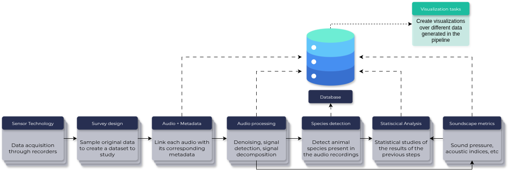
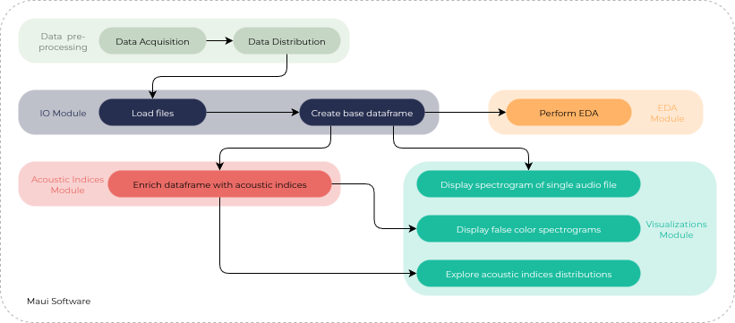

# Summary

Passive Acoustic Monitoring (PAM) technology generates vast volumes of environmental audio recordings. 
There is a diverse range of tools, either to compute mathematical features 
(acoustic indices) or to perform machine learning tasks such as classification. However, 
researchers still lack unified tools for visually exploring soundscape repositories.
We introduce Maui, an open‑source Python framework designed to simplify exploratory analysis 
of large ecoacoustic datasets by placing visualization directly into the PAM workflow.
Maui provides modules for data ingestion and metadata parsing, supports flexible incorporation 
of user‑computed acoustic indices, and offers a suite of high‑level plotting functions. 
It includes methods for creating false‑color spectrograms [@towsey2014visualization], customizable Diel plots, and 
radar, violin, and parallel plots for multivariate index comparison. These visualizations are useful 
to reveal temporal, spatial, and taxonomic patterns at scale. With a modular architecture, 
Maui leverages existing Python libraries for bioacoustic data processing, while focusing 
on interactive, publication‑quality graphics that facilitate hypothesis generation and 
large‑scale soundscape synthesis. By filling a gap in ecoacoustic visual data analytics 
and bringing together visualizations drawn from acoustic ecology literature 
[@towsey2014visualization; @phillips2018revealing; @towsey2015navigation],
Maui helps researchers study soundscape dynamics.

# Statement of need

The sounds originating from anthrophonic, biophonic, and geophonic sources in a landscape define its soundscape [@pijanowski2011soundscape]. Substantial amounts of acoustic data, particularly from biophonic sources, can be captured using low-cost autonomous recorders deployed for Passive Acoustic Monitoring (PAM)[@browning2017passive]. An active research line in environmental ecology, acoustic ecology addresses the study of natural soundscapes [@grinfeder2022we]. The discipline relies heavily on computational methods for audio data processing and analysis [@Pijanowski2024; @Napier2024ESWA].

A diversity of PAM data processing pipelines are described in the literature. In the particular context of detecting the presence of animal species in the recordings, [@gibb2019emerging] defines a seven-step pipeline (see \ref{fig:proposed_pam_pipeline}). Departing from data acquisition, sampling the recordings before analysis is often necessary, given the large data volumes collected. Researchers extract the associated metadata from the resulting subset of audio files, including location, time, climate conditions, and recorder type. A fourth step involves preprocessing the audio files, e.g., to reduce noise and emphasize relevant signals. Researchers can then perform acoustic event detection and labeling, e.g., to identify animal species. This typically involves multiple iterations of computing metrics such as acoustic features, ecological indices, and conducting statistical analyses of intermediate results to gain a comprehensive understanding of the soundscape.

As PAM pipelines are instantiated multiple times (see \autoref{fig:proposed_pam_pipeline}), researchers typically accumulate vast datasets of audio recordings collected at multiple sites over extended periods. These large repositories of environmental acoustic recordings are a valuable source of knowledge when analyzed from a global perspective. Knowledge extraction requires practical software tools and libraries to streamline data exploration and analysis. Analysts need flexibility to investigate their accumulated data from multiple perspectives, considering different data and metadata properties. Conducting global investigations can uncover insights beyond previous soundscape analyses, help identify potential improvements in existing practices and methodologies, and support large-scale PAM data analysis in the long term [@Napier2024ESWA]. 

Data visualization is a powerful tool for extracting insights in this inherently exploratory context. It enables the representation of metadata and acoustic features across time and locations, providing comprehensive overviews of the data repositories from multiple perspectives. Compelling visualizations can enhance data exploration and summarization beyond the standard processing pipeline. We consider an extended PAM pipeline that integrates visualization into a framework to promote exploratory analysis of the data accumulated in acoustic repositories resulting from multiple instantiations of the standard pipeline, as illustrated in \autoref{fig:proposed_pam_pipeline}. 
The dissemination of acoustic ecology practices has motivated many open-source tools and libraries to facilitate tasks such as computing acoustic features and applying machine learning algorithms. Following this trend, we introduce Maui, a Python package built on top of Plotly to support visual exploratory tasks on ecoacoustic data repositories. 

# Modules architecture and useflow

Maui implements methods that focuses primarily on creating visualizations that require the computation of acoustic features. We assume users already have their preferred tools for this computation. A brief description of each module follows.

**File Metadata**: a helper module, it provides methods to decode the relevant metadata values (e.g., location, date, time) encoded in audio file names. It is common practice to adopt some file naming template to encode information; e.g., a file named "LEEC02\_20161202\_050100\_br" refers to an acoustic recording obtained in a landscape identified as "LEEC02" on December 2, 2016, recording capture started at time 05h:01m from a device placed at an environment identified as "br". This module provides a method for users to specify how metadata must be decoded from a given naming template. Once the encoding policy is informed, the method parses the file names to extract the corresponding metadata values. 

**IO**: implements multiple input and output methods, e.g., to load a single file or an entire dataset consisting of multiple audio files and create a Python data frame that incorporates the extracted metadata, as per the policy defined by the previous module. This module exists so that users can focus on understanding the data without being concerned with low-level operations, such as parsing metadata from file names to obtain the data frame. The remaining methods from this and other modules will operate on the resulting data frame. 

**Samples**: a utility module to retrieve a small sample dataset already embedded in Maui for demonstration purposes. 

**EDA**: facilitates creating visualizations that convey overviews of the dataset stored in the Python data frame, depicting data sample distributions across multiple user-defined dimensions, such as date, time, and location. It includes methods to generate summary reports, duration analysis views, daily distribution views, heatmaps, and histograms. 

**Acoustic Indices**: Maui does not include modules or methods for acoustic index computation or feature extraction. Instead, this module provides an interface to incorporate into the working data frame the audio features obtained using some user-defined method or external tools.
As feature computation on large datasets can be computationally demanding, we considered it necessary to streamline the acoustic feature computation task. 

**Visualizations**: a core module that incorporates methods to create visualizations of audio data with a few lines of code, simplifying data exploration tasks.

**Utils**: another utility module that implements methods for data preprocessing operations, such as audio segmentation and data preparation steps required, e.g., to create false color spectrograms.

Figure \autoref{fig:use_flow}shows the different modules, their relationships, and the major tasks they implement. Each module focuses on a specific task and operates independently from the others. Still, they interact as a user executes data processing tasks and creates data visualizations. As such, they together implement a complete data visualization solution. The *IO* module is central to Maui because it provides methods that simplify the data loading process. Nonetheless, it is not required to load a dataset, as long as the user provides the required data frame. A complete example of each method and resulting visualizations created from real world datasets are available at example notebooks hosted on [GitHub](https://github.com/maui-software/maui-software-examples)[^1].

[^1]: https://github.com/maui-software/maui-software-examples

# Related Work

There are several softwares solutions that address acoustic ecology challenges, but, as far as we are concerned, Maui is the first visualization framework developed specifically to meet the needs of acoustic ecology. In the realm of open source Python packages, Scikit-maad [@ulloa2021scikit] and Open Soundscape [@lapp2023opensoundscape] are tools that complement Maui. Scikit-maad encompasses a complete workflow to load, preprocess, and transform data, find regions of interest, compute temporal and spectral acoustic indices, estimate sound pressure levels, and calculate the distance from an audio source to the recording device. Open Soundscape is focused on data classification and spatial localization of acoustic events. The package includes methods for training convolutional neural networks (CNNs), performing data augmentation, and other utility functions required to execute machine learning tasks.

# Acknowledgements

This project was supported by grants from the State of São Paulo Research Foundation (FAPESP 2021/08322-3) and the Brazilian Research Council (CNPq 301847/2017-7). We thank Dr. Milton Cezar Ribeiro, from LEEC, for insightful discussions.

# References
